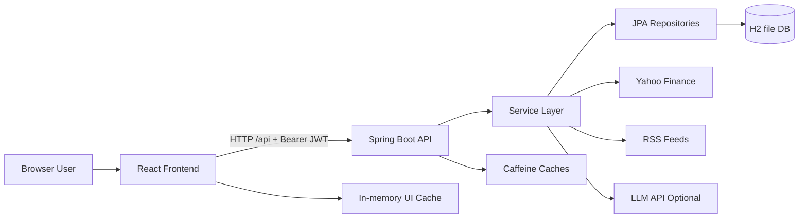

# 108-08-Portfolio-Manager

Excel File Link : https://docs.google.com/spreadsheets/d/10w-M3sMVEzicuMOmBeUxVbo3azkRK2Wu-cRgqhG8PFM/edit?usp=sharing
## 1. Purpose and Scope
This document explains how the current `108-08-Portfolio-Manager` system is built and how requests flow across frontend, backend, database, security, and external integrations.

The architecture now supports two role-based user journeys:
- `OWNER` (customer): personal portfolio dashboard and holdings workflows
- `FUND_MANAGER`: manages multiple customers and their portfolios via manager APIs and UI

---

## 2. Technology and Runtime Topology

## Frontend
- React + Vite SPA (`frontend/`)
- Route protection and role-aware navigation (`ProtectedRoute`, `ManagerRoute`, `Sidebar`, `ManagerSidebar`)
- Service layer for API abstraction (`frontend/src/services/*.js`)

## Backend
- Spring Boot REST API (`backend/`)
- Layered design: Controller -> Service -> Repository -> Model
- JWT-based stateless authentication + role authorization

## Data
- H2 file-based DB in development (`jdbc:h2:file:./data/portfoliomdb`)
- JPA/Hibernate persistence
- Field-level encryption for sensitive business values

## External dependencies
- Yahoo Finance for quote/history
- RSS feeds for market news
- Optional OpenAI-compatible endpoint for insights and image-based statement extraction

---

## 3. End-to-End Flow (System Level)



---

## 4. Backend Architecture Flow

## 4.1 Controller layer (API boundary)
Key controllers under `backend/src/main/java/com/portfoliom/controller/`:
- `AuthController`: login and current-user profile
- `HoldingsController`: owner holdings/report/history/import/export workflows
- `PortfolioController` + `HoldingController`: portfolio-scoped operations
- `ManagerController`: fund manager customer administration + customer holdings management
- `NewsController`, `InsightsController`: external enrichment endpoints

## 4.2 Service layer (business logic)
- `UserService`: auth, user lookup, role context
- `CustomerService`: manager-facing customer lifecycle and summaries
- `HoldingService`: merge-or-create, valuation, aggregate performance
- `PortfolioService`: portfolio ownership and access-scoped retrieval
- `PriceService` + `PriceLookupService`: current pricing with cache-backed calls
- `PriceHistoryService` + `PriceSeriesFetcher`: trend series generation
- `HoldingImportService` + `StatementScanService`: CSV/image import pipelines
- `ExportService`: CSV and PDF report generation
- `NewsService` + `RssFeedFetcher`: market/news feed aggregation
- `InsightsService` + `ChatCompletionClient`: optional textual portfolio insights

## 4.3 Persistence layer
Repositories:
- `UserRepository`
- `PortfolioRepository`
- `HoldingRepository`

Core models:
- `User` (includes role and manager linkage)
- `Portfolio`
- `Holding`
- `Role` (`OWNER`, `FUND_MANAGER`)

---

## 5. Security and Authentication Flow

## 5.1 Request filtering and authorization
`SecurityConfig` defines a stateless filter chain:
- Public: `/api/auth/**`, health/info, Swagger, H2 console
- `hasRole("FUND_MANAGER")`: `/api/manager/**`
- `hasRole("OWNER")`: `/api/portfolios/**`, `/api/holdings/**`
- All others require authentication

`JwtAuthFilter` validates bearer tokens and sets authentication context for downstream access control.

## 5.2 Login flow
1. Frontend posts credentials to `POST /api/auth/login`
2. `UserService` validates credentials
3. `JwtService.generateToken(username, role)` issues token
4. Frontend stores token and loads `/api/auth/me`
5. Frontend role state drives route and sidebar rendering (`isFundManager`)

---

## 6. Role-Based Functional Flows

## 6.1 OWNER flow
1. Login as owner
2. Access dashboard (`/`) and holdings (`/holdings`)
3. Frontend calls `/api/holdings`, `/api/holdings/history`, `/api/news`, optional `/api/insights/summary`
4. Owner can add/update/delete/import/export holdings
5. Backend computes performance and returns enriched portfolio views

## 6.2 FUND_MANAGER flow
1. Login as fund manager
2. Access manager routes:
   - `/manager`
   - `/manager/customers/:customerId`
   - `/manager/customers/:customerId/holdings`
3. Frontend calls manager endpoints under `/api/manager/customers/**`
4. Manager can create/delete customer accounts, manage customer holdings, and view customer-specific history/performance

---

## 7. Data Protection and Integrity

## 7.1 Encrypted field persistence
Sensitive fields use JPA attribute converters:
- `EncryptedStringConverter`
- `EncryptedBigDecimalConverter`
- `EncryptedLocalDateConverter`

`EncryptionKeyHolder` sources encryption key from environment (`app.encryption.key`) and provides runtime key material.

## 7.2 Controlled defaults and seed data
`DataSeeder` bootstraps baseline accounts and starter domain data (owner + manager defaults and sample holdings where configured), enabling immediate functional testing.

---

## 8. Caching and Performance Flow

## Backend cache (`CacheConfig`)
- Price cache for quote calls
- Price-history cache for chart data
- News cache for RSS pulls

## Frontend cache
- In-memory TTL cache in `frontend/src/utils/cache.js`
- Holdings/history cache invalidated after mutations/imports

This dual caching reduces external call frequency, improves dashboard responsiveness, and stabilizes perceived latency.

---

## 9. Integration Flows

## Market price + history
- Service layer calls Yahoo Finance endpoints
- Fallbacks preserve UX if provider is unavailable

## Market news
- RSS feeds aggregated and scoped to holdings + general market context

## AI-driven features (optional)
- `InsightsService` generates plain-language summaries
- `StatementScanService` extracts holding rows from uploaded images
- Both features short-circuit cleanly when API credentials are not configured

---

## 10. Error Handling and Resilience

## Backend resilience
- `GlobalExceptionHandler` standardizes API error payloads
- Validation and not-found exceptions return explicit messages
- External integration failures are guarded to avoid total workflow failure

## Frontend resilience
- `apiClient.js` normalizes error extraction
- 401 handling clears token and redirects to login
- Pages show graceful empty/error states rather than failing hard


## Admin / Fund Manager

Responsibilities:

* Login
* Manage customers
* Create customer portfolios
* Add/remove stocks, bonds, cash
* Edit customer holdings
* View analytics
* Compare performance against Sensex
* Generate reports

## Customer (Investor)

Responsibilities:

* View own portfolio
* View returns
* View asset allocation
* View performance graphs
* View fund manager details

---

# High-Level Architecture

```
                 React Frontend
                       |
                       |
                 REST API
                       |
              Spring Boot Backend
                       |
        --------------------------------
        |              |               |
     Customer      Portfolio        Analytics
     Service       Service          Service
        |              |               |
        --------------------------------
                       |
                  PostgreSQL
```

---

# Technology Stack

## Backend

* Java 17
* Spring Boot
* Spring MVC
* Spring Data JPA
* Hibernate
* PostgreSQL
* REST APIs
* Swagger

## Frontend

* React
* Tailwind CSS
* Recharts / Chart.js

## External APIs

Market data:

* Yahoo Finance API
* NSE/BSE API (optional)

---

# Database Design

## Entity Relationship

```
FundManager

        |
        |
        |
Customers

        |
        |
        |
Portfolio

        |
        |
        |
Holdings

        |
        |
        |
Stocks
```

---

# Tables

## 1. Fund_Manager

```
fund_manager

id
name
email
phone
password
created_at
```

Example:

## Docker Setup

Run the full stack (MySQL + backend + frontend) using Docker Compose:

```bash
docker compose up --build
```

Services:

* Frontend (Vite dev server): http://localhost:8082
* Backend (Spring Boot, `mvn spring-boot:run`): http://localhost:8083
* Database: MySQL 8, persisted in the `mysql_data` volume, exposed on port 8084

Everything runs with working defaults out of the box - no `.env` file is required. To customize
credentials or secrets, copy `.env.example` to `.env` and edit the values; Docker Compose picks it
up automatically.

To stop and remove containers:

```bash
docker compose down
```

To also wipe the MySQL data volume:

```bash
docker compose down -v
```

| id | name         |
| -- | ------------ |
| 1  | Rahul Sharma |

---

# 2. Customer

```
customer

id
name
email
phone
risk_profile
fund_manager_id
created_at
```

Relationship:

Many customers belong to one fund manager.

Example:

```
Rahul(Fund Manager)

        |
        |
------------------
|        |        |
John    Mike    Sarah
```

---

# 3. Portfolio

```
portfolio

id
customer_id
portfolio_name
total_value
created_date
risk_level
```

Example:

```
John

Portfolio:
------------
Retirement Fund
Value:
₹20,00,000
```

---

# 4. Asset

Stocks/Bonds/Cash

```
asset

id

symbol

name

type

current_price
```

Example:

| Symbol   | Type      |
| -------- | --------- |
| RELIANCE | Stock     |
| HDFC     | Stock     |
| GOLD     | Commodity |

---

# 5. Portfolio Holdings

This connects portfolio and assets.

```
portfolio_holding

id

portfolio_id

asset_id

quantity

buy_price

purchase_date
```

Example:

John Portfolio:

```
RELIANCE

Quantity:
100

Buy Price:
2200
```

---

# 6. Transaction History

For audit.

```
transaction

id

portfolio_id

asset_id

transaction_type

quantity

price

date
```

Example:

```
BUY RELIANCE
100 shares
₹2200
```

---

# 7. Benchmark Performance

For Sensex comparison

```
benchmark

id

name

date

value
```

Example:

```
Sensex

01-01-2026

72000
```

---

# API Design

## Authentication

```
POST

/api/auth/login
```

---

# Fund Manager APIs

## View Customers

```
GET

/api/fund-manager/{id}/customers
```

Response:

```json
[
 {
  "id":1,
  "name":"John",
  "portfolioValue":2000000
 }
]
```

---

## Add Customer

```
POST

/api/customers
```

Request:

```json
{
"name":"John",
"email":"john@gmail.com",
"riskProfile":"HIGH"
}
```

---

## Edit Customer

```
PUT

/api/customers/{id}
```

---

# Portfolio APIs

## Create Portfolio

```
POST

/api/portfolio
```

Example:

```json
{
"name":"Retirement Portfolio",
"customerId":1
}
```

---

## Add Stock

```
POST

/api/portfolio/{id}/holdings
```

Request:

```json
{
"symbol":"TCS",
"quantity":20,
"buyPrice":3500
}
```

---

## Remove Stock

```
DELETE

/api/holding/{id}
```

---

# Analytics APIs

## Portfolio Performance

```
GET

/api/portfolio/{id}/performance
```

Response:

```json
{
"investment":1000000,

"currentValue":1250000,

"returns":25,

"cagr":12.5
}
```

---

# Dashboard Requirements

Fund Manager Dashboard:

## Overview Cards

```
Total Customers

20


Assets Under Management

₹5 Crore


Average Return

14%


Best Performing Client

John
```

---

## Customer Performance Table

```
Customer      Portfolio       Return

John          20L             +18%

Mike          15L             +12%

Sarah         10L             +22%
```

---

# Portfolio Analytics

Graphs:

## 1. Portfolio Growth

Line chart:

```
Value

|
|          *
|       *
|    *
| *
----------------
    Months
```

---

## 2. Asset Allocation

Pie Chart:

```
Stocks       60%

Bonds        30%

Cash         10%
```

---

## 3. Benchmark Comparison

Very important requirement.

Compare:

```
Portfolio Return

vs

Sensex Return

vs

Index Fund
```

Example:

```
1 Year Performance


Portfolio       +18%

Sensex          +12%

Nifty Index     +14%
```

---

# AI Features (Good for Extra Marks)

Add:

## AI Portfolio Advisor

Example:

Customer portfolio:

```
Technology Stocks 70%
```

AI says:

```
Risk Alert:

Your portfolio is heavily concentrated in technology.

Suggested allocation:

Technology 40%
Banks 20%
Bonds 30%
Cash 10%
```

---

## Natural Language Query

Customer asks:

> "Which stock performed best this year?"

AI responds:

```
TCS gave the highest return of 22%.
```

---

# Advanced Feature: Portfolio Risk Score

Calculate:

```
Risk Score =

Volatility +
Sector Concentration +
Historical Loss
```

Display:

```
Low Risk
Medium Risk
High Risk
```

---

# Spring Boot Package Structure

```
com.wealthsphere

│
├── controller
│
├── service
│
├── repository
│
├── model
│
├── dto
│
├── exception
│
└── security


## 1. Project Overview
**PortfolioM** is a role-based portfolio management system that supports two main user types:
- **OWNER (Customer):** views and manages their own portfolio
- **FUND_MANAGER:** manages multiple customers and their portfolios

The application is a full-stack web solution built with:
- **Frontend:** React + Vite + Chart.js + React Router
- **Backend:** Spring Boot REST API
- **Database:** JPA/Hibernate with H2 for local development and PostgreSQL for deployment
- **Security:** JWT authentication, role-based authorization, encrypted sensitive fields, and optional AI/WebAuthn-style features depending on configuration
- **External integrations:** market data APIs, RSS news feeds, and optional AI services for insights and image extraction

The system is designed to support real portfolio operations: customer onboarding, holding management, performance analytics, benchmark comparisons, and report generation.

---

## 2. Problem Statement
A wealth-management team needs a platform where a fund manager can:
- manage many customers
- create and maintain portfolios
- add and edit holdings
- compare performance against benchmarks such as Sensex and index funds
- generate reports and dashboards
- keep portfolio data secure and organized

Without such a system, portfolio records are often split across spreadsheets, statement files, and manual calculations. PortfolioM centralizes these workflows into one application.

---

## 3. Project Goals
The project aims to provide:
- customer and portfolio administration
- holding management with valuation calculations
- dashboard analytics for both managers and customers
- secure login and role-based access control
- import/export support
- benchmark comparison and performance graphs
- optional AI assistance for extra insights

---

## 4. Technology Stack
### Backend
- Java 17
- Spring Boot 3.3.x
- Spring MVC
- Spring Data JPA
- Spring Security
- Spring Cache
- Hibernate
- H2 database (development)
- PostgreSQL (deployment)
- Swagger/OpenAPI
- JWT libraries
- OpenCSV
- OpenPDF

### Frontend
- React 18
- Vite
- React Router
- Chart.js / react-chartjs-2
- Vite PWA plugin

### External services
- Yahoo Finance for market quote/history data
- RSS feeds for news
- Optional AI/chat-completion endpoint for insights and image-based extraction

---

## 5. High-Level Architecture
PortfolioM follows a layered client-server architecture.

```text
Browser User
    |
    v
React Frontend
    |
    | HTTP requests with JWT bearer token
    v
Spring Boot REST API
    |
    +--> Security Filter Chain / JWT Validation
    +--> Controller Layer
    +--> Service Layer
    +--> Repository Layer
    +--> JPA Entities / Database
    |
    +--> External APIs (Yahoo Finance, RSS, AI)
```

### Architecture principles
- clear separation of concerns
- stateless authentication
- role-based route and endpoint protection
- scoped portfolio access per user/customer
- graceful fallback when external services are unavailable

---

## 6. Repository Structure
### Backend
- `backend/src/main/java/com/portfoliom/config/` – security, cache, seeding, OpenAPI config
- `backend/src/main/java/com/portfoliom/controller/` – REST controllers
- `backend/src/main/java/com/portfoliom/dto/` – request and response objects
- `backend/src/main/java/com/portfoliom/exception/` – exception classes and handler
- `backend/src/main/java/com/portfoliom/model/` – entities and enums
- `backend/src/main/java/com/portfoliom/repository/` – JPA repositories
- `backend/src/main/java/com/portfoliom/security/` – JWT, encryption, and related support
- `backend/src/main/java/com/portfoliom/service/` – business logic and integrations

### Frontend
- `frontend/src/App.jsx` – shell, routing, and layout
- `frontend/src/context/` – auth, theme, toast contexts
- `frontend/src/components/` – reusable UI elements
- `frontend/src/pages/` – login, dashboard, holdings, manager screens
- `frontend/src/services/` – API access layer
- `frontend/src/utils/` – caching, formatting, helper functions
- `frontend/src/config/api.js` – endpoint definitions and base URL

---

## 7. User Roles and Access Model
### OWNER / Customer
- logs in with username and password
- views own portfolio dashboard
- manages holdings within assigned portfolios
- sees allocation, performance, and charts

### FUND_MANAGER
- logs in with manager credentials
- manages customer accounts
- creates and deletes customers
- opens customer dashboards
- manages customer holdings
- views customer-level portfolio history and analytics

This role split is implemented in both frontend routing and backend security rules.

---

## 8. Backend Documentation

### 8.1 Application startup
The backend starts from `PortfolioMApplication.java`.
At startup the app:
- reads configuration and environment variables
- initializes the JPA layer
- sets up the security filter chain
- enables caching
- seeds starter data when appropriate

### 8.2 Controllers
#### `AuthController`
Handles login and current-user profile operations.
Key endpoints:
- `POST /api/auth/login`
- `GET /api/auth/me`

#### `ManagerController`
Used by fund managers to manage customers and their data.
Key endpoints include:
- list customers
- create customer
- delete customer
- get customer profile
- get customer holdings
- add/update/delete customer holdings
- get customer holdings history

#### `PortfolioController`
Portfolio-scoped endpoints for:
- listing portfolios
- creating portfolios
- updating/deleting portfolios
- getting portfolio performance

#### `HoldingController`
Holding-scoped endpoints within a portfolio:
- list holdings
- add holding
- update holding
- delete holding

#### `HoldingsController`
Flat holdings APIs used by dashboard/report screens:
- holdings overview
- add/update/delete holding
- CSV import/export
- image import
- sample CSV download
- portfolio history

#### `NewsController`
Returns:
- holdings-based market headlines
- general market headlines

#### `InsightsController`
Returns a plain-language AI-generated summary when the optional AI service is configured.

### 8.3 Services
#### `UserService`
- authenticates users
- loads current user
- returns customers or manager information
- creates and deletes users

#### `CustomerService`
- lists customers with portfolio snapshots
- creates customer accounts under a manager
- deletes customers and cascaded data
- returns customer-level performance summary

#### `PortfolioService`
- creates portfolios for specific owners
- returns owner-scoped portfolios
- deletes portfolio data for an owner
- creates a default portfolio when required

#### `HoldingService`
- adds, edits, and deletes holdings
- merges duplicate tickers
- calculates weighted average purchase price on merge
- computes cost basis, current value, gain/loss, and return percentage
- returns performance summaries for owner or portfolio scope
- optionally refreshes prices before summary generation

#### `PriceService` and `PriceLookupService`
- obtain live quote data
- cache prices
- fall back safely if market data cannot be retrieved

#### `PriceHistoryService` and `PriceSeriesFetcher`
- create time-series history for charts
- support range selection such as 1d, 1w, 1m, all

#### `HoldingImportService`
- import holdings from CSV
- normalize rows into holdings
- merge duplicates where needed

#### `StatementScanService`
- optionally read holdings from an uploaded screenshot or statement image
- uses a vision-capable AI model when configured

#### `ExportService`
- generates CSV exports
- generates PDF exports

#### `NewsService` and `RssFeedFetcher`
- aggregate ticker-related news
- fetch market headlines

#### `InsightsService` and `ChatCompletionClient`
- build a portfolio summary prompt
- call optional AI/chat endpoint

### 8.4 Data access
Repositories provide database access for:
- `UserRepository`
- `PortfolioRepository`
- `HoldingRepository`

### 8.5 Domain model
Important backend types:
- `User`
- `Role`
- `Portfolio`
- `Holding`
- `HoldingType`
- `WebauthnCredential`

---

## 9. Frontend Documentation

### 9.1 Routing and app shell
`frontend/src/App.jsx` defines the route structure and shell layout.

Main routes:
- `/login` – login screen
- `/` – owner dashboard
- `/holdings` – owner holdings page
- `/manager` – customer list for fund managers
- `/manager/customers/:customerId` – customer dashboard
- `/manager/customers/:customerId/holdings` – customer holdings page

Route guarding:
- `ProtectedRoute` protects owner pages
- `ManagerRoute` protects manager-only pages

### 9.2 Authentication context
`frontend/src/context/AuthContext.jsx`:
- stores token locally
- calls `/api/auth/me` after login
- exposes `isAuthenticated` and `isFundManager`
- keeps username, name, email, role, and manager information in state
- clears invalid sessions automatically

### 9.3 API layer
The service layer under `frontend/src/services/` abstracts backend calls:
- `apiClient.js` – shared fetch wrapper and 401 handling
- `authService.js` – login and profile calls
- `holdingsService.js` – owner holdings operations
- `managerService.js` – manager/customer operations
- `newsService.js` – market headlines
- `insightsService.js` – AI summary endpoint

### 9.4 Main UI modules
#### Common UI components
- buttons
- cards
- tables
- modals
- confirm dialogs
- skeleton loaders
- charts
- stat cards
- sidebars
- mobile header
- theme toggle

#### Pages
##### `LoginPage`
Handles login and role-based session creation.

##### `DashboardPage`
Shows:
- summary cards
- performance trend chart
- allocation chart
- portfolio performance visualization
- news feed
- optional AI summary

##### `HoldingsPage`
Shows:
- holdings table
- add/edit/delete actions
- CSV import
- image import
- CSV/PDF export
- sample CSV download

##### Manager pages
- `ManagerCustomersPage`
- `ManagerCustomerDashboardPage`
- `ManagerCustomerHoldingsPage`

These pages allow fund managers to work across multiple customers.

---

## 10. Security Documentation

### 10.1 JWT authentication
Flow:
1. user submits login credentials
2. backend validates user and role
3. backend generates JWT
4. frontend stores JWT locally
5. requests include `Authorization: Bearer <token>`
6. backend filter validates token for protected routes

### 10.2 Role-based authorization
Security rules separate:
- `OWNER` access to personal portfolio routes
- `FUND_MANAGER` access to manager routes

This ensures customers cannot access manager-only screens and manager APIs unless their role permits it.

### 10.3 Encrypted data storage
Sensitive fields are protected with JPA converters before persistence.
This covers data such as:
- portfolio names
- holding names
- tickers
- quantities
- prices
- dates

### 10.4 Optional AI and biometric support
- AI endpoints are optional and disabled if API credentials are missing
- image-based extraction uses an optional vision model
- biometric login / WebAuthn-style support is designed to improve convenience and security where configured

---

## 11. Data Flow Documentation

### 11.1 Owner login flow
1. User opens the login page.
2. Frontend submits credentials to `/api/auth/login`.
3. Backend validates credentials and creates JWT.
4. Frontend stores token and calls `/api/auth/me`.
5. Routing and UI update according to the user role.

### 11.2 Owner dashboard flow
1. User opens the dashboard.
2. Frontend requests holdings, history, news, and optional summary.
3. Backend computes performance and fetches live data.
4. Frontend renders stat cards, charts, and news.

### 11.3 Owner holdings flow
1. User adds or edits holdings.
2. Frontend sends a holdings request.
3. Backend validates and merges or updates data.
4. Backend recalculates performance.
5. Frontend refreshes the table and charts.

### 11.4 Manager flow
1. Fund manager logs in.
2. Manager page loads the customer list.
3. Customer dashboard and holdings pages fetch customer-specific data.
4. Manager can create or remove customers and holdings.

### 11.5 Import flow
1. User uploads CSV or image.
2. Backend parses the data.
3. Duplicate tickers are merged.
4. Results are returned in an import result object.

### 11.6 Export flow
1. User requests CSV or PDF export.
2. Backend generates the file from the current summary.
3. Frontend triggers download.

---

## 12. Performance and Caching
### Backend caching
The backend caches:
- live prices
- historical data
- news feeds

### Frontend caching
The frontend caches:
- holdings
- history
- news

This reduces repeated network calls and makes repeated screen loads faster.

### Refresh behavior
Some summary flows allow a refresh flag so that price data can be invalidated and re-fetched when needed.

---

## 13. External Integrations
### Yahoo Finance
Used for:
- current quotes
- chart / history data

### RSS feeds
Used for:
- ticker-related headlines
- general market news

### Optional AI endpoint
Used for:
- portfolio summaries
- image-based statement extraction

All optional integrations are designed to fail gracefully when not configured.

---

## 14. Database Design
### Main entities
- `User` – login account and role
- `Portfolio` – portfolio owned by a user
- `Holding` – asset position inside a portfolio
- `Role` – enum for owner and fund manager
- `WebauthnCredential` – biometric credential record

### Relationships
- one manager can oversee multiple customers
- one customer can own one or more portfolios
- a portfolio contains multiple holdings
- holdings are evaluated as a group to generate current value and return calculations

### Persistence behavior
- JPA/Hibernate handles ORM mapping
- H2 file-based database stores local development data across restarts
- schema updates automatically in development mode

---

## 15. Configuration and Environment Variables
### Backend
- `JWT_SECRET`
- `DB_ENCRYPTION_KEY`
- `OWNER_USERNAME`
- `OWNER_PASSWORD`
- `MANAGER_USERNAME`
- `MANAGER_PASSWORD`
- `INSIGHTS_API_KEY`
- `INSIGHTS_API_URL`
- `INSIGHTS_MODEL`
- `INSIGHTS_VISION_MODEL`

### Frontend
- `VITE_API_BASE_URL`
- `VITE_SUPABASE_URL` and `VITE_SUPABASE_ANON_KEY` if that integration is enabled in a given environment

### Ports
- Backend: `4001`
- Frontend dev server: `5173`

---

## 16. Setup and Run Guide
### Backend
```bash
cd backend
mvn spring-boot:run
```

### Frontend
```bash
cd frontend
npm install
npm start
```

### Database / deployment
```bash
docker compose up -d
```

### Tests
```bash
cd backend
mvn test
```

---

## 17. Testing and Validation
The project includes tests for controllers and services, and the current codebase supports validation of:
- login and auth flows
- role-based route handling
- customer management
- holdings merge logic
- portfolio valuation
- import/export behavior
- news and insights fallback paths

Recommended future test additions:
- customer authorization boundaries
- end-to-end manager journeys
- refresh behavior for holdings data
- AI failure scenarios
- image-import parsing edge cases

---

## 18. Limitations
- External market/news data depends on third-party availability.
- Optional AI features require correct API configuration.
- Fund-manager workflows add complexity compared with a single-user tracker.
- Financial accuracy depends on live quote freshness and imported statement quality.

---

## 19. Future Improvements
- stronger auditing and activity logging
- more integration tests
- background jobs for heavy imports and reports
- additional benchmark comparisons
- risk scoring and allocation recommendations
- richer analytics for fund manager dashboards
- improved accessibility and responsive design refinements

---

## 20. Conclusion
PortfolioM is a production-style portfolio management application that combines:
- secure login and access control
- separate owner and fund-manager workflows
- portfolio and holding management
- analytics, charts, and performance tracking
- report generation and data import/export
- external market data and optional AI assistance

It is a strong full-stack project because it demonstrates real application architecture, secure design, reusable UI patterns, and practical business workflows.
---

