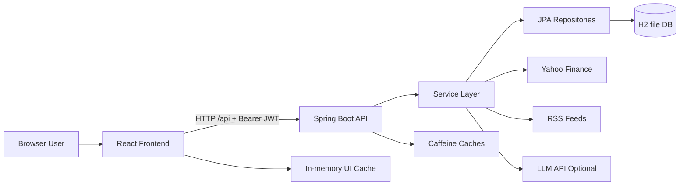

# 108-08-Portfolio-Manager

Excel File Link : https://docs.google.com/spreadsheets/d/10w-M3sMVEzicuMOmBeUxVbo3azkRK2Wu-cRgqhG8PFM/edit?usp=sharing
## 1. Purpose and Scope
This document explains how the current `108-08-Portfolio-Manager` system is built and how requests flow across frontend, backend, database, security, and external integrations.

The architecture now supports two role-based user journeys:
- `OWNER` (customer): personal portfolio dashboard and holdings workflows
- `FUND_MANAGER`: manages multiple customers and their portfolios via manager APIs and UI

---

## 2. Technology and Runtime Topology

## Frontend
- React + Vite SPA (`frontend/`)
- Route protection and role-aware navigation (`ProtectedRoute`, `ManagerRoute`, `Sidebar`, `ManagerSidebar`)
- Service layer for API abstraction (`frontend/src/services/*.js`)

## Backend
- Spring Boot REST API (`backend/`)
- Layered design: Controller -> Service -> Repository -> Model
- JWT-based stateless authentication + role authorization

## Data
- H2 file-based DB in development (`jdbc:h2:file:./data/portfoliomdb`)
- JPA/Hibernate persistence
- Field-level encryption for sensitive business values

## External dependencies
- Yahoo Finance for quote/history
- RSS feeds for market news
- Optional OpenAI-compatible endpoint for insights and image-based statement extraction

---

## 3. End-to-End Flow (System Level)



---

## 4. Backend Architecture Flow

## 4.1 Controller layer (API boundary)
Key controllers under `backend/src/main/java/com/portfoliom/controller/`:
- `AuthController`: login and current-user profile
- `HoldingsController`: owner holdings/report/history/import/export workflows
- `PortfolioController` + `HoldingController`: portfolio-scoped operations
- `ManagerController`: fund manager customer administration + customer holdings management
- `NewsController`, `InsightsController`: external enrichment endpoints

## 4.2 Service layer (business logic)
- `UserService`: auth, user lookup, role context
- `CustomerService`: manager-facing customer lifecycle and summaries
- `HoldingService`: merge-or-create, valuation, aggregate performance
- `PortfolioService`: portfolio ownership and access-scoped retrieval
- `PriceService` + `PriceLookupService`: current pricing with cache-backed calls
- `PriceHistoryService` + `PriceSeriesFetcher`: trend series generation
- `HoldingImportService` + `StatementScanService`: CSV/image import pipelines
- `ExportService`: CSV and PDF report generation
- `NewsService` + `RssFeedFetcher`: market/news feed aggregation
- `InsightsService` + `ChatCompletionClient`: optional textual portfolio insights

## 4.3 Persistence layer
Repositories:
- `UserRepository`
- `PortfolioRepository`
- `HoldingRepository`

Core models:
- `User` (includes role and manager linkage)
- `Portfolio`
- `Holding`
- `Role` (`OWNER`, `FUND_MANAGER`)

---

## 5. Security and Authentication Flow

## 5.1 Request filtering and authorization
`SecurityConfig` defines a stateless filter chain:
- Public: `/api/auth/**`, health/info, Swagger, H2 console
- `hasRole("FUND_MANAGER")`: `/api/manager/**`
- `hasRole("OWNER")`: `/api/portfolios/**`, `/api/holdings/**`
- All others require authentication

`JwtAuthFilter` validates bearer tokens and sets authentication context for downstream access control.

## 5.2 Login flow
1. Frontend posts credentials to `POST /api/auth/login`
2. `UserService` validates credentials
3. `JwtService.generateToken(username, role)` issues token
4. Frontend stores token and loads `/api/auth/me`
5. Frontend role state drives route and sidebar rendering (`isFundManager`)

---

## 6. Role-Based Functional Flows

## 6.1 OWNER flow
1. Login as owner
2. Access dashboard (`/`) and holdings (`/holdings`)
3. Frontend calls `/api/holdings`, `/api/holdings/history`, `/api/news`, optional `/api/insights/summary`
4. Owner can add/update/delete/import/export holdings
5. Backend computes performance and returns enriched portfolio views

## 6.2 FUND_MANAGER flow
1. Login as fund manager
2. Access manager routes:
   - `/manager`
   - `/manager/customers/:customerId`
   - `/manager/customers/:customerId/holdings`
3. Frontend calls manager endpoints under `/api/manager/customers/**`
4. Manager can create/delete customer accounts, manage customer holdings, and view customer-specific history/performance

---

## 7. Data Protection and Integrity

## 7.1 Encrypted field persistence
Sensitive fields use JPA attribute converters:
- `EncryptedStringConverter`
- `EncryptedBigDecimalConverter`
- `EncryptedLocalDateConverter`

`EncryptionKeyHolder` sources encryption key from environment (`app.encryption.key`) and provides runtime key material.

## 7.2 Controlled defaults and seed data
`DataSeeder` bootstraps baseline accounts and starter domain data (owner + manager defaults and sample holdings where configured), enabling immediate functional testing.

---

## 8. Caching and Performance Flow

## Backend cache (`CacheConfig`)
- Price cache for quote calls
- Price-history cache for chart data
- News cache for RSS pulls

## Frontend cache
- In-memory TTL cache in `frontend/src/utils/cache.js`
- Holdings/history cache invalidated after mutations/imports

This dual caching reduces external call frequency, improves dashboard responsiveness, and stabilizes perceived latency.

---

## 9. Integration Flows

## Market price + history
- Service layer calls Yahoo Finance endpoints
- Fallbacks preserve UX if provider is unavailable

## Market news
- RSS feeds aggregated and scoped to holdings + general market context

## AI-driven features (optional)
- `InsightsService` generates plain-language summaries
- `StatementScanService` extracts holding rows from uploaded images
- Both features short-circuit cleanly when API credentials are not configured

---

## 10. Error Handling and Resilience

## Backend resilience
- `GlobalExceptionHandler` standardizes API error payloads
- Validation and not-found exceptions return explicit messages
- External integration failures are guarded to avoid total workflow failure

## Frontend resilience
- `apiClient.js` normalizes error extraction
- 401 handling clears token and redirects to login
- Pages show graceful empty/error states rather than failing hard


## Admin / Fund Manager

Responsibilities:

* Login
* Manage customers
* Create customer portfolios
* Add/remove stocks, bonds, cash
* Edit customer holdings
* View analytics
* Compare performance against Sensex
* Generate reports

## Customer (Investor)

Responsibilities:

* View own portfolio
* View returns
* View asset allocation
* View performance graphs
* View fund manager details

---

# High-Level Architecture

```
                 React Frontend
                       |
                       |
                 REST API
                       |
              Spring Boot Backend
                       |
        --------------------------------
        |              |               |
     Customer      Portfolio        Analytics
     Service       Service          Service
        |              |               |
        --------------------------------
                       |
                  PostgreSQL
```

---

# Technology Stack

## Backend

* Java 17
* Spring Boot
* Spring MVC
* Spring Data JPA
* Hibernate
* PostgreSQL
* REST APIs
* Swagger

## Frontend

* React
* Tailwind CSS
* Recharts / Chart.js

## External APIs

Market data:

* Yahoo Finance API
* NSE/BSE API (optional)

---

# Database Design

## Entity Relationship

```
FundManager

        |
        |
        |
Customers

        |
        |
        |
Portfolio

        |
        |
        |
Holdings

        |
        |
        |
Stocks
```

---

# Tables

## 1. Fund_Manager

```
fund_manager

id
name
email
phone
password
created_at
```

Example:

## Docker Setup

Run the full stack (MySQL + backend + frontend) using Docker Compose:

```bash
docker compose up --build
```

Services:

* Frontend (Vite dev server): http://localhost:8082
* Backend (Spring Boot, `mvn spring-boot:run`): http://localhost:8083
* Database: MySQL 8, persisted in the `mysql_data` volume, exposed on port 8084

Everything runs with working defaults out of the box - no `.env` file is required. To customize
credentials or secrets, copy `.env.example` to `.env` and edit the values; Docker Compose picks it
up automatically.

To stop and remove containers:

```bash
docker compose down
```

To also wipe the MySQL data volume:

```bash
docker compose down -v
```

| id | name         |
| -- | ------------ |
| 1  | Rahul Sharma |

---

# 2. Customer

```
customer

id
name
email
phone
risk_profile
fund_manager_id
created_at
```

Relationship:

Many customers belong to one fund manager.

Example:

```
Rahul(Fund Manager)

        |
        |
------------------
|        |        |
John    Mike    Sarah
```

---

# 3. Portfolio

```
portfolio

id
customer_id
portfolio_name
total_value
created_date
risk_level
```

Example:

```
John

Portfolio:
------------
Retirement Fund
Value:
₹20,00,000
```

---

# 4. Asset

Stocks/Bonds/Cash

```
asset

id

symbol

name

type

current_price
```

Example:

| Symbol   | Type      |
| -------- | --------- |
| RELIANCE | Stock     |
| HDFC     | Stock     |
| GOLD     | Commodity |

---

# 5. Portfolio Holdings

This connects portfolio and assets.

```
portfolio_holding

id

portfolio_id

asset_id

quantity

buy_price

purchase_date
```

Example:

John Portfolio:

```
RELIANCE

Quantity:
100

Buy Price:
2200
```

---

# 6. Transaction History

For audit.

```
transaction

id

portfolio_id

asset_id

transaction_type

quantity

price

date
```

Example:

```
BUY RELIANCE
100 shares
₹2200
```

---

# 7. Benchmark Performance

For Sensex comparison

```
benchmark

id

name

date

value
```

Example:

```
Sensex

01-01-2026

72000
```

---

# API Design

## Authentication

```
POST

/api/auth/login
```

---

# Fund Manager APIs

## View Customers

```
GET

/api/fund-manager/{id}/customers
```

Response:

```json
[
 {
  "id":1,
  "name":"John",
  "portfolioValue":2000000
 }
]
```

---

## Add Customer

```
POST

/api/customers
```

Request:

```json
{
"name":"John",
"email":"john@gmail.com",
"riskProfile":"HIGH"
}
```

---

## Edit Customer

```
PUT

/api/customers/{id}
```

---

# Portfolio APIs

## Create Portfolio

```
POST

/api/portfolio
```

Example:

```json
{
"name":"Retirement Portfolio",
"customerId":1
}
```

---

## Add Stock

```
POST

/api/portfolio/{id}/holdings
```

Request:

```json
{
"symbol":"TCS",
"quantity":20,
"buyPrice":3500
}
```

---

## Remove Stock

```
DELETE

/api/holding/{id}
```

---

# Analytics APIs

## Portfolio Performance

```
GET

/api/portfolio/{id}/performance
```

Response:

```json
{
"investment":1000000,

"currentValue":1250000,

"returns":25,

"cagr":12.5
}
```

---

# Dashboard Requirements

Fund Manager Dashboard:

## Overview Cards

```
Total Customers

20


Assets Under Management

₹5 Crore


Average Return

14%


Best Performing Client

John
```

---

## Customer Performance Table

```
Customer      Portfolio       Return

John          20L             +18%

Mike          15L             +12%

Sarah         10L             +22%
```

---

# Portfolio Analytics

Graphs:

## 1. Portfolio Growth

Line chart:

```
Value

|
|          *
|       *
|    *
| *
----------------
    Months
```

---

## 2. Asset Allocation

Pie Chart:

```
Stocks       60%

Bonds        30%

Cash         10%
```

---

## 3. Benchmark Comparison

Very important requirement.

Compare:

```
Portfolio Return

vs

Sensex Return

vs

Index Fund
```

Example:

```
1 Year Performance


Portfolio       +18%

Sensex          +12%

Nifty Index     +14%
```

---

# AI Features (Good for Extra Marks)

Add:

## AI Portfolio Advisor

Example:

Customer portfolio:

```
Technology Stocks 70%
```

AI says:

```
Risk Alert:

Your portfolio is heavily concentrated in technology.

Suggested allocation:

Technology 40%
Banks 20%
Bonds 30%
Cash 10%
```

---

## Natural Language Query

Customer asks:

> "Which stock performed best this year?"

AI responds:

```
TCS gave the highest return of 22%.
```

---

# Advanced Feature: Portfolio Risk Score

Calculate:

```
Risk Score =

Volatility +
Sector Concentration +
Historical Loss
```

Display:

```
Low Risk
Medium Risk
High Risk
```

---

# Spring Boot Package Structure

```
com.wealthsphere

│
├── controller
│
├── service
│
├── repository
│
├── model
│
├── dto
│
├── exception
│
└── security

---

